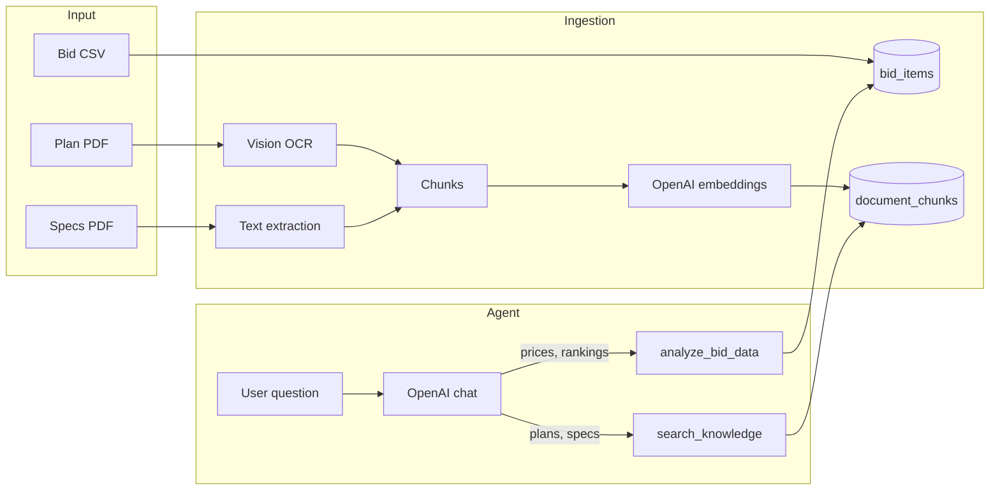
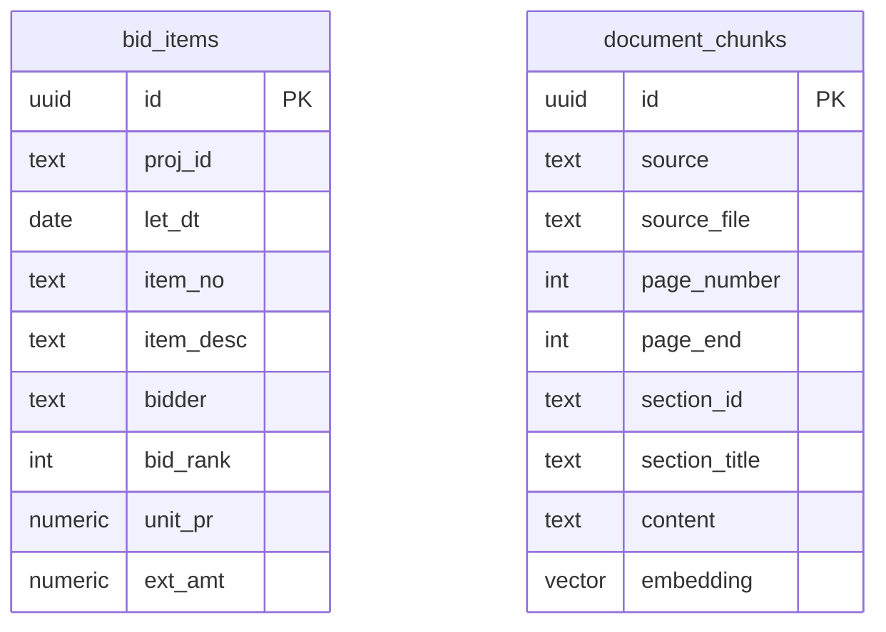
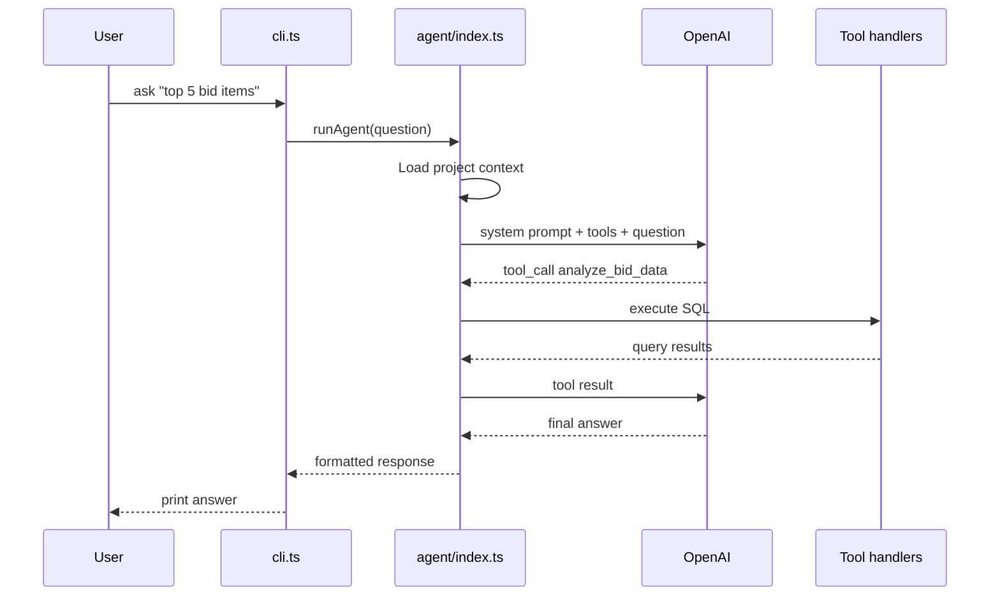

# Architecture

A CLI-based construction estimating assistant. It ingests bid tabulation CSVs and project PDFs (plan sets and specifications), stores them in PostgreSQL, and answers questions through an OpenAI-powered agent that routes between SQL analytics and semantic document search.

---

## At a glance



**Two data paths, one agent:**

| Data type | Storage | How questions are answered |
|-----------|---------|----------------------------|
| Bid tabulation (CSV) | Structured rows in `bid_items` | Agent writes PostgreSQL `SELECT` queries |
| Plans & specs (PDF) | Text chunks + vector embeddings in `document_chunks` | Cosine similarity search over embeddings |

Ingestion runs via the CLI before asking questions. The agent only reads data.

---

## Project layout

```
src/
├── cli.ts                 # Entry point: ingest and ask commands
├── config.ts              # Environment variables and defaults
├── types.ts               # Shared TypeScript types
├── agent/
│   ├── index.ts           # Agent loop, system prompt, tool dispatch
│   └── tools/
│       ├── definitions.ts # OpenAI function tool schemas
│       ├── analyze.ts     # SQL execution for bid data
│       ├── search.ts      # Vector search over documents
│       └── bid-items-schema.ts  # Schema + query guidance for the LLM
├── ingestion/
│   ├── ingest.ts          # CLI ingestion orchestration
│   ├── csv.ts             # CSV parsing → bid_items
│   ├── pdf-planset.ts     # Plan PDF → vision OCR → chunks
│   └── pdf-specs.ts       # Specs PDF → text extraction → section chunks
├── storage/
│   ├── db.ts              # Postgres client
│   └── embeddings.ts      # OpenAI embeddings + chunk storage
└── utils/                 # Path resolution, batching, debug logging
```

Database schema lives in [`schema.sql`](schema.sql). Migrations run via [`scripts/migrate.ts`](scripts/migrate.ts).

---

## Core features

### 1. Bid data analytics (SQL)

Structured bid tabulation data — item prices, quantities, bidder rankings, totals — is stored as rows and queried with SQL.

The agent receives the table schema, query-writing rules, and a list of available projects at runtime, then generates a PostgreSQL `SELECT` for each question.

- Schema and guidance: [`src/agent/tools/bid-items-schema.ts`](src/agent/tools/bid-items-schema.ts)
- Execution: [`src/agent/tools/analyze.ts`](src/agent/tools/analyze.ts)

When multiple projects exist and the user does not specify one, the agent defaults to the project with the most recent letting date (`let_dt`).

**Example questions:** top expensive items, bidder comparisons, unit price outliers.

### 2. Document search (vectors)

Plan drawings and specification prose are chunked, embedded with OpenAI `text-embedding-3-small` (1536 dimensions), and stored in pgvector.

At query time, the user's question is embedded and matched against stored chunks using cosine distance. Results include citation metadata (file name, page, section ID).

- Search logic: [`src/agent/tools/search.ts`](src/agent/tools/search.ts)
- Embedding + storage: [`src/storage/embeddings.ts`](src/storage/embeddings.ts)

The agent is instructed to end document-based answers with a **Sources** section listing file, page, and section references.

**Example questions:** demolition notes on a plan sheet, what section D-705 says about underdrains.

### 3. File ingestion (CLI)

| File type | Pipeline | Output |
|-----------|----------|--------|
| `.csv` | Parse with PapaParse, map known columns, batch insert | Rows in `bid_items` |
| `.pdf` (planset) | Render pages → vision OCR → one chunk per page | Rows in `document_chunks` |
| `.pdf` (specs) | Extract text layer → split by section headings | Rows in `document_chunks` |

Entry point: [`src/ingestion/ingest.ts`](src/ingestion/ingest.ts)

Plan OCR is slow (render + vision API per page). Specs ingestion requires a usable text layer — scanned specs without selectable text are rejected.

---

## Data model



**`bid_items`** — one row per bidder line item. `bid_rank = 1` means the winning/low bid for that item.

**`document_chunks`** — searchable text segments from PDFs. `source` is either `planset` or `specs`.

Full DDL: [`schema.sql`](schema.sql)

---

## Agent loop

The agent is a standard OpenAI tool-calling loop with two tools.



Key behaviors in [`src/agent/index.ts`](src/agent/index.ts):

- **System prompt** defines tool routing, grounding, and citation format.
- **Project context** is injected into the `analyze_bid_data` tool description at runtime.
- **Max 4 tool iterations** per question.

### Tool routing

| Question about… | Tool | Why |
|-----------------|------|-----|
| Prices, totals, rankings, outliers | `analyze_bid_data` | Exact math on structured data |
| Plan notes, drawing callouts, spec sections | `search_knowledge` | Semantic retrieval over prose |
| Both bid data and documents | Both tools, then synthesize | Combined answers |

---

## CLI

[`src/cli.ts`](src/cli.ts) exposes two commands (via `bun ingest` and `bun ask` in `package.json`):

```bash
bun ingest --csv ./data/sample_bid_tabulation.csv
bun ingest --pdf ./data/plans.pdf --pdf-type planset --pages 1-5,12
bun ingest --pdf ./data/specifications-vol-1.pdf --pdf-type specs
bun ask "What are the top 5 most expensive bid items?"
bun ask   # interactive REPL mode
```

---

## Infrastructure

| Component | Role |
|-----------|------|
| **Bun** | Runtime, package manager, test runner |
| **PostgreSQL + pgvector** | Structured bid data + vector search ([`docker-compose.yml`](docker-compose.yml)) |
| **OpenAI API** | Chat model for agent + OCR; embedding model for vectors |
| **postgres.js** | Database client ([`src/storage/db.ts`](src/storage/db.ts)) |

Configuration is loaded from `.env` — see [`.env.example`](.env.example) and [`src/config.ts`](src/config.ts).

Set `DEBUG_MODE=true` to log agent internals to stderr via [`src/utils/debug.ts`](src/utils/debug.ts).

---

## Design decisions

**SQL for bids, vectors for documents.** The agent routes between structured SQL and semantic search rather than forcing one approach.

**Agent-generated SQL, executed directly.** No SQL validation layer — acceptable for a demo, not production-safe.

**Vision OCR for plans.** Plan pages are rendered to PNG and sent to the chat model for OCR.

**Text extraction for specs.** Direct extraction plus section-based chunking is faster than OCR for specification PDFs.

**CLI-only ingestion.** Ingestion is a setup step; the agent focuses on reading and answering.

---

## Out of scope (intentionally omitted)

Given more time, I would include the following — they were deliberately left out of this submission to keep the codebase simple and focused:

- **Read-only SQL validation** — allowlist tables, block DML/DDL, enforce row limits.
- **Hybrid search** — combine vector retrieval with keyword matching for section IDs like `D-705`.
- **Agent-side ingestion** — chat-based file upload (removed for simplicity; CLI pre-processing is clearer for demos).
- **LLM-tunable search thresholds** — expose `limit` and `min_similarity` to the model when needed.
- **Unknown CSV column handling** — generic header mapping and strict date coercion.
- **OCR/embedding retry/backoff** — resilience for transient API failures.
- **Incremental DB migrations** — versioned schema upgrades instead of fresh `--destroy`.
- **Vision fallback for specs** — OCR path for scanned specification PDFs.
- **Embedding caching** and **multi-project document isolation**.

---

## Tests

```bash
bun test
```

Integration tests use a real Postgres instance (see [`tests/helpers/postgres.ts`](tests/helpers/postgres.ts)).
